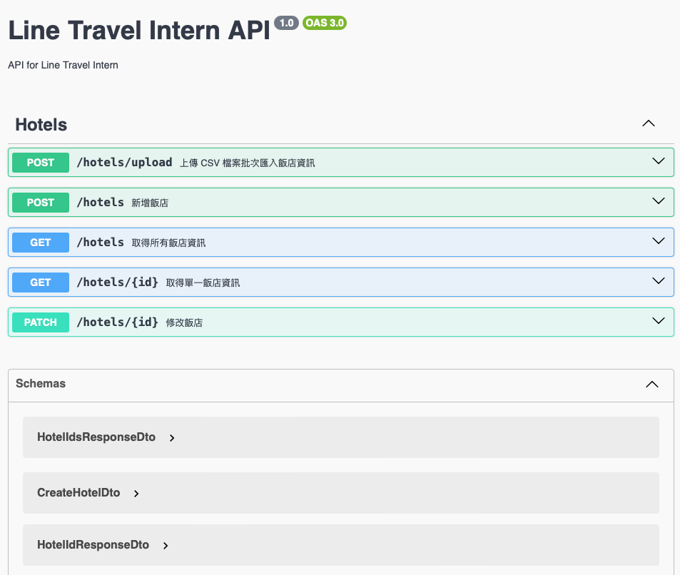

<p align="center">
  <a href="http://nestjs.com/" target="blank"></a>
</p>

[circleci-image]: https://img.shields.io/circleci/build/github/nestjs/nest/master?token=abc123def456
[circleci-url]: https://circleci.com/gh/nestjs/nest

  <p align="center">A progressive <a href="http://nodejs.org" target="_blank">Node.js</a> framework for building efficient and scalable server-side applications.</p>
    <p align="center">
<a href="https://www.npmjs.com/~nestjscore" target="_blank"></a>
<a href="https://www.npmjs.com/~nestjscore" target="_blank"></a>
<a href="https://www.npmjs.com/~nestjscore" target="_blank"></a>
<a href="https://circleci.com/gh/nestjs/nest" target="_blank"></a>
<a href="https://coveralls.io/github/nestjs/nest?branch=master" target="_blank"></a>
<a href="https://discord.gg/G7Qnnhy" target="_blank"></a>
<a href="https://opencollective.com/nest#backer" target="_blank"></a>
<a href="https://opencollective.com/nest#sponsor" target="_blank"></a>
  <a href="https://paypal.me/kamilmysliwiec" target="_blank"></a>
    <a href="https://opencollective.com/nest#sponsor"  target="_blank"></a>
  <a href="https://twitter.com/nestframework" target="_blank"></a>
</p>
  <!--[](https://opencollective.com/nest#backer)
  [](https://opencollective.com/nest#sponsor)-->

## Description

This project is a backend API service for managing hotel information, built with NestJS and MySQL.


## Project setup

1. clone this repository
2. if you haven't installed Docker you have to install it
3. create .env file and add your database credentials
  e.g.
  ```env
  MYSQL_ROOT_PASSWORD=root
  MYSQL_DATABASE=line_travel
  MYSQL_USER=appuser
  MYSQL_PASSWORD=appuserpassword
  ```
4. Build and run the containers
  ```bash
  # For development
  $ docker-compose up -d
  
  # For production
  $ docker-compose -f docker-compose.prod.yml up -d
  
  # For running tests
  $ docker-compose -f docker-compose.test.yml up --abort-on-container-exit
  ```
5. The application will be available at http://localhost:3000

## Development

For local development without Docker:

1. Install dependencies
  ```bash
  $ npm install
  ```

2. Run the project
  ```bash
  $ npm run start:dev
  ```

## Run tests

```bash
# unit tests
$ npm run test
```

## System Features

- API 上傳 .csv file 批次匯入飯店資訊
- API 查詢所有飯店資訊
- API 查詢單一飯店資訊
- API 新增單一飯店資訊
- API 修改單一飯店資訊

## API Documentation
API documentation is available through Swagger UI at `/api` endpoint when running the application.


### API Endpoints
- `POST /hotels/upload`
- `POST /hotels`
- `GET /hotels`
- `GET /hotels/:id`
- `PATCH /hotels/:id`